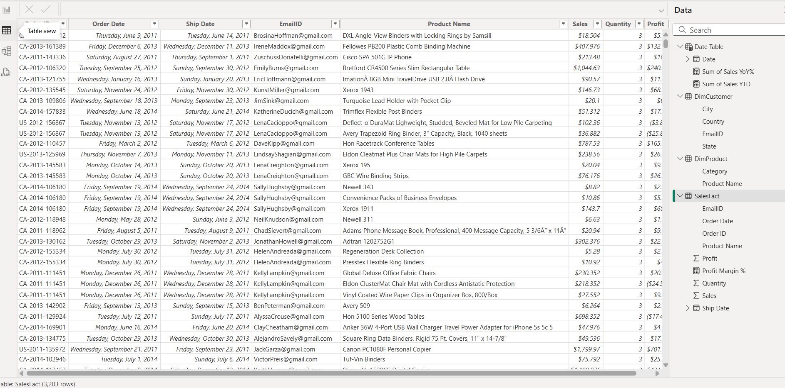
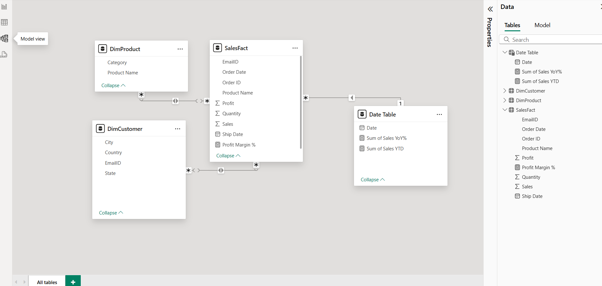
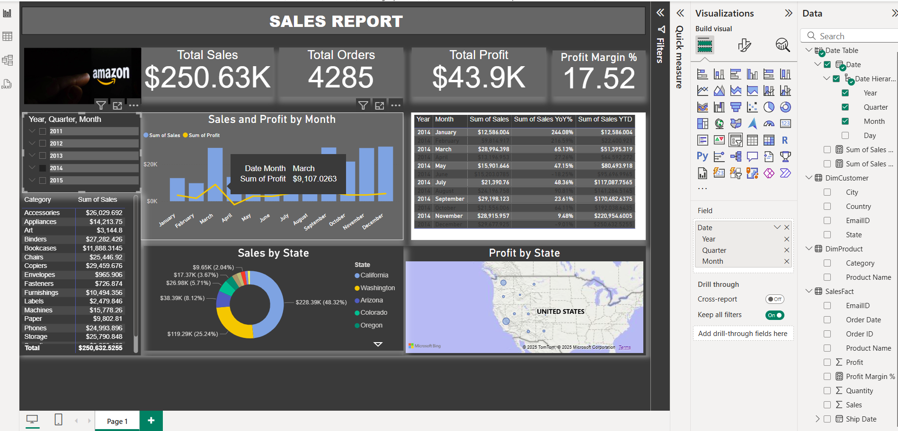

#  Sales Performance Report

This Power BI report analyzes sales performance for a Amazon company in the United State from 2011 to 2015. It includes dynamic KPIs, time intelligence, and geographic trends.

##  Key Features

- Total Sales, Profit, Quantity Sold
- Profit Margin %, YoY Growth
- Sales by Product Category, Region, and Time
- Dynamic filtering via slicers

##  KPI Definitions

| KPI Name         | Description                                  | DAX Measure Used     |
|------------------|--------------------------------------------------------------------|
| Total Sales      | Sum of all sales revenue                     | `Total Sales = SUM(SalesFact[Sales])`     |
| Total Profit     | Sum of profit after cost                     | `Total Profit = SUM(SalesFact[Profit])`   |
| Profit Margin %  | Profit as a percentage of sales revenue      | `Profit Margin % = DIVIDE(Profit, Sales)` |
| Total Quantity   | Units of products sold                       | `Total Quantity = SUM(SalesFact[Quantity])`|

## Dashboard Screenshots

  ......... This shows the raw dataset loaded into Power BI.
.....This diagram shows the star schema used for data modeling.
......An overview of the interactive dashboard with KPIs and filters.

##  Time Intelligence Used

- Sales YTD, YoY% 

## 📐 Data Model Overview

Star schema with:
- `SalesFact` (fact table)
- `Date`, `Product`, `Customer` (dimension tables)
